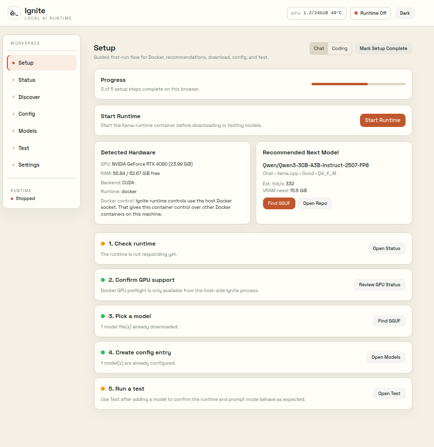

# Ignite

**Local AI Runtime**

Running local AI today means installing multiple tools, hunting for the right model, guessing whether it fits your hardware, hand-writing config files, and hoping it all works.

Ignite handles the whole thing. Run the install and start scripts, or use `docker compose` directly if you prefer to manage the stack yourself, and you get a working local AI setup without hand-writing config files or guessing model settings.

It detects your hardware, recommends models that fit, downloads them, configures everything, and gives you a working endpoint. All from one UI.

If you can install Docker, you can run local AI.



> **Why "Ignite"?** Getting local AI running feels like rubbing sticks together. Ignite is the match.

## Platform Support

- Linux: supported
- Windows: not supported yet by the current install/start/stop scripts
- macOS: not supported for the current GPU-backed runtime path

Ignite currently targets Linux with Docker and NVIDIA GPU passthrough.

## What You Need

- Docker
- Docker Compose
- NVIDIA GPU
- `nvidia-smi` working on the host
- NVIDIA Container Toolkit configured so this works:

```bash
docker run --rm --gpus all --entrypoint sh ghcr.io/ggml-org/llama.cpp:server-cuda -lc 'nvidia-smi -L'
```

If that command fails, Ignite will not be able to run GPU-backed models.

The install and management scripts in `./scripts` are Linux shell scripts. They are not intended for Windows PowerShell or Docker Desktop workflows yet.

## Install

```bash
git clone <repo-url>
cd ignite
./scripts/install.sh
```

What `install.sh` does:
- checks Docker
- prepares `./config` and `./models`
- checks Docker GPU passthrough
- tells you the next command to run

## Start

```bash
./scripts/start.sh
```

Then open:

- `http://127.0.0.1:<IGNITE_PORT>` (default: `3000`)

What `start.sh` does:
- checks Docker
- prepares `./config` and `./models`
- runs `docker compose up -d --build`

If you prefer to avoid helper scripts, you can start Ignite manually:

```bash
docker compose up -d --build
```

You can also override the published ports through `.env`:

```bash
IGNITE_PORT=3000
LLAMA_SWAP_PORT=8090
```

After changing ports, restart Ignite.

## Stop

```bash
./scripts/stop.sh
```

What `stop.sh` does:
- runs `docker compose down`

## Update

```bash
./scripts/update.sh
```

What `update.sh` does:
- pulls the latest Git changes
- pulls the latest runtime images
- rebuilds and restarts the stack

## Default Folders

- `./models`
- `./config`

These are the default paths for normal users.

Advanced users can override them:

```bash
SWAPDECK_MODELS_DIR=/path/to/models SWAPDECK_CONFIG_DIR=/path/to/config ./scripts/start.sh
```

With port overrides:

```bash
SWAPDECK_MODELS_DIR=/path/to/models
SWAPDECK_CONFIG_DIR=/path/to/config
IGNITE_PORT=3000
LLAMA_SWAP_PORT=8090
```

## First Run

1. Open `Setup`
2. Check Docker and GPU status
3. Review the recommended model
4. Open `Models` and download a GGUF
5. Add it to config with a launch preset
6. Open `Test` and confirm it responds
7. Use `Status` to copy the API endpoint for other apps

## Pages

| Page | Purpose |
|------|---------|
| `Setup` | Guided first-run flow |
| `Status` | Runtime health, logs, Docker GPU preflight, API endpoint |
| `Discover` | `llmfit` recommendations for the current machine |
| `Config` | Structured and raw YAML editing for `llama-swap` |
| `Models` | Download, inspect, delete, and add GGUFs to config |
| `Test` | Send prompts through the running runtime |
| `Settings` | Show runtime settings and Docker-managed paths |

## Stack

- `ignite`: React + FastAPI app on `:3000`
- `llama-runtime`: `llama-swap` + `llama-server`
- `llmfit`: hardware-aware model recommendations

## API

| Method | Endpoint | Purpose |
|--------|----------|---------|
| `GET` | `/api/status` | Runtime state, GPU stats, Docker preflight |
| `GET` | `/api/discover/recommendations` | `llmfit` recommendation proxy |
| `GET` | `/api/config` | Read runtime config |
| `PUT` | `/api/config` | Save runtime config |
| `GET` | `/api/config/raw` | Read raw YAML |
| `PUT` | `/api/config/raw` | Save raw YAML |
| `POST` | `/api/config/add-model` | Generate a model entry from a GGUF |
| `GET` | `/api/models` | List installed GGUF files |
| `POST` | `/api/models/download` | Start model download |
| `POST` | `/api/test` | Send a prompt through `llama-swap` |
| `GET` | `/health` | App health check |

## Security

- Ignite is for local or trusted-network use
- there is no built-in auth layer
- do not expose ports directly to the public internet
- use Tailscale or another private overlay if remote access is needed
- the Ignite app container mounts `/var/run/docker.sock` so the UI can start and stop the runtime container
- that Docker socket mount gives Ignite control over Docker containers on the host

## Third-Party Software

Ignite is built around and depends on the following open-source projects:

- [`llama-swap`](https://github.com/mostlygeek/llama-swap) — MIT License
- [`llama.cpp`](https://github.com/ggml-org/llama.cpp) — MIT License
- [`llmfit`](https://github.com/alexsjones/llmfit) — MIT License

Ignite does not change the licenses of those projects. Their respective licenses apply to the components and binaries they provide.

## License

MIT
