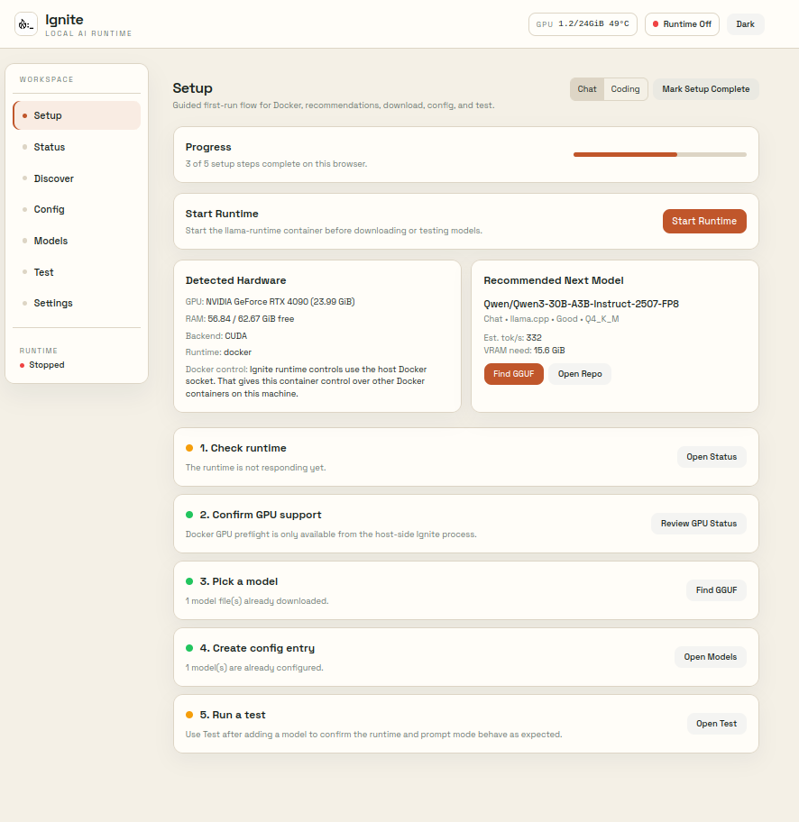

# Ignite

**Local AI Runtime**

Running local AI today means installing multiple tools, hunting for the right model, guessing whether it fits your hardware, hand-writing config files, and hoping it all works.

Ignite handles the whole thing. Run the install and start scripts, or use `docker compose` directly if you prefer to manage the stack yourself, and you get a working local AI setup without hand-writing config files or guessing model settings.

It detects your hardware, recommends models that fit, downloads them, configures everything, and gives you working endpoints for LLM and optional speech features. All from one UI.

If you can install Docker, you can run local AI.



> **Why "Ignite"?** Getting local AI running feels like rubbing sticks together. Ignite is the match.

## Platform Support

- Linux: supported
- Windows: not supported yet by the current install/start/stop scripts
- macOS: not supported for the current GPU-backed runtime path

Ignite currently targets Linux with Docker and NVIDIA GPU passthrough.

## What You Need

- Docker
- Docker Compose
- NVIDIA GPU
- `nvidia-smi` working on the host
- NVIDIA Container Toolkit configured so this works:

```bash
docker run --rm --gpus all --entrypoint sh ghcr.io/ggml-org/llama.cpp:server-cuda -lc 'nvidia-smi -L'
```

If that command fails, Ignite will not be able to run GPU-backed models.

The install and management scripts in `./scripts` are Linux shell scripts. They are not intended for Windows PowerShell or Docker Desktop workflows yet.

## Install

```bash
git clone <repo-url>
cd ignite
./scripts/install.sh
```

What `install.sh` does:
- checks Docker
- prepares `./config` and `./models`
- checks Docker GPU passthrough
- tells you the next command to run

## Start

```bash
./scripts/start.sh
```

Then open:

- `http://127.0.0.1:<IGNITE_PORT>` (default: `3000`)

What `start.sh` does:
- checks Docker
- prepares `./config` and `./models`
- runs `docker compose up -d`
- starts optional speech support with `Speaches` in CPU mode by default

If you changed code, Dockerfiles, or dependencies and need fresh containers, use:

```bash
./scripts/rebuild.sh
```

What `rebuild.sh` does:
- checks Docker
- prepares `./config` and `./models`
- runs `docker compose up -d --build`

If you prefer to avoid helper scripts, you can start Ignite manually:

```bash
docker compose up -d
```

To rebuild manually:

```bash
docker compose up -d --build
```

You can also override the published ports, speech mode, and runtime base image through `.env`:

```bash
IGNITE_PORT=3000
LLAMA_SWAP_PORT=8090
LLAMA_CPP_IMAGE=ghcr.io/ggml-org/llama.cpp:server-cuda
SPEACHES_ACCEL=cpu
```

Speech mode options:
- `SPEACHES_ACCEL=cpu`
- `SPEACHES_ACCEL=cuda`

If you want to point Ignite at your own prebuilt `llama.cpp` runtime image, set:

- `LLAMA_CPP_IMAGE=spadav/ik-llama:latest` for the published `ik_llama.cpp` runtime image
- or `LLAMA_CPP_IMAGE=ghcr.io/yourname/llama.cpp:server-cuda-custom` for your own custom build

After changing ports, speech mode, or `LLAMA_CPP_IMAGE`, restart Ignite.

## Stop

```bash
./scripts/stop.sh
```

What `stop.sh` does:
- runs `docker compose stop`

If you want to fully remove the containers instead of just stopping them:

```bash
docker compose down
```

## Update

```bash
./scripts/update.sh
```

What `update.sh` does:
- pulls the latest Git changes
- pulls the latest runtime images
- rebuilds and restarts the stack

## Restart Behavior

By default Ignite uses Docker restart policy:

```bash
IGNITE_RESTART_POLICY=no
```

That means:
- containers do not restart automatically unless you enable it
- the recommended way to change this is from the Ignite Settings page

Advanced users can still override it in `.env` if they want a different Docker restart policy.

## Default Folders

- `./models`
- `./config`

These are the default paths for normal users.

Advanced users can override them:

```bash
IGNITE_MODELS_DIR=/path/to/models IGNITE_CONFIG_DIR=/path/to/config ./scripts/start.sh
```

With port overrides:

```bash
IGNITE_MODELS_DIR=/path/to/models
IGNITE_CONFIG_DIR=/path/to/config
IGNITE_PORT=3000
LLAMA_SWAP_PORT=8090
LLAMA_CPP_IMAGE=ghcr.io/ggml-org/llama.cpp:server-cuda
SPEACHES_ACCEL=cpu
IGNITE_RESTART_POLICY=no
```

When you change speech mode or the `llama.cpp` base image from the Ignite Settings page, Ignite saves that choice in `ignite-settings.json` inside your config folder. The host scripts reuse that saved value automatically on the next `start.sh`, `rebuild.sh`, or `update.sh`.

If you want to try `ik_llama.cpp` in Ignite without building it yourself first, use:

```bash
LLAMA_CPP_IMAGE=spadav/ik-llama:latest
```

That image is intended as the `ik_llama.cpp` runtime option, while `ghcr.io/ggml-org/llama.cpp:server-cuda` remains the default mainline runtime.

## First Run

1. Open `Setup`
2. Check Docker and GPU status
3. Review the recommended model
4. Open `Models` and download a GGUF
5. Add it to config with a launch preset
6. Open `Playground` and confirm it responds
7. Optionally install a speech model from `Discover -> Speech`
8. Use `Status` to copy the API endpoint for other apps

## Pages

| Page | Purpose |
|------|---------|
| `Setup` | Guided first-run flow |
| `Status` | Runtime health, active endpoints, Docker GPU preflight |
| `Runtime` | Runtime model state, load/unload, request activity |
| `Discover` | `llmfit` LLM recommendations and downloadable speech registry |
| `Config` | Structured and raw YAML editing for `llama-swap` |
| `Models` | Installed GGUF and speech models, plus GGUF download/config flow |
| `Playground` | Chat, vision, TTS, and STT testing from one page |
| `Logs` | Docker/runtime logs |
| `Updates` | Runtime version checks and update status |
| `Settings` | Collapsed runtime settings, speech mode, paths, and endpoint reference |

## Stack

- `ignite`: React + FastAPI app on `:3000`
- `llama-runtime`: `llama-swap` + `llama-server`
- `llmfit`: hardware-aware model recommendations
- `speaches`: optional speech service for STT and TTS

## API

| Method | Endpoint | Purpose |
|--------|----------|---------|
| `GET` | `/api/status` | Runtime state, GPU stats, Docker preflight, speech status |
| `GET` | `/api/discover/recommendations` | `llmfit` recommendation proxy |
| `GET` | `/api/config` | Read runtime config |
| `PUT` | `/api/config` | Save runtime config |
| `GET` | `/api/config/raw` | Read raw YAML |
| `PUT` | `/api/config/raw` | Save raw YAML |
| `POST` | `/api/config/add-model` | Generate a model entry from a GGUF |
| `GET` | `/api/models` | List installed GGUF files |
| `POST` | `/api/models/download` | Start model download |
| `GET` | `/api/speech/registry` | List downloadable speech models from Speaches registry |
| `GET` | `/api/speech/models` | List installed speech models |
| `GET` | `/api/speech/voices` | List voices for an installed TTS model |
| `POST` | `/api/speech/models/install/{model_id}` | Install a speech model |
| `POST` | `/api/speech/test/tts` | Generate audio through Speaches |
| `POST` | `/api/speech/test/stt` | Transcribe audio through Speaches |
| `POST` | `/api/test` | Send an LLM prompt through `llama-swap` |
| `GET` | `/health` | App health check |

## Security

- Ignite is for local or trusted-network use
- there is no built-in auth layer
- do not expose ports directly to the public internet
- use Tailscale or another private overlay if remote access is needed
- the Ignite app container mounts `/var/run/docker.sock` so the UI can start and stop the runtime container
- that Docker socket mount gives Ignite control over Docker containers on the host

## Third-Party Software

Ignite is built around and depends on the following open-source projects:

- [`llama-swap`](https://github.com/mostlygeek/llama-swap) — MIT License
- [`llama.cpp`](https://github.com/ggml-org/llama.cpp) — MIT License
- [`llmfit`](https://github.com/alexsjones/llmfit) — MIT License
- [`speaches`](https://github.com/speaches-ai/speaches) — MIT License

Ignite does not change the licenses of those projects. Their respective licenses apply to the components and binaries they provide.

## License

MIT
