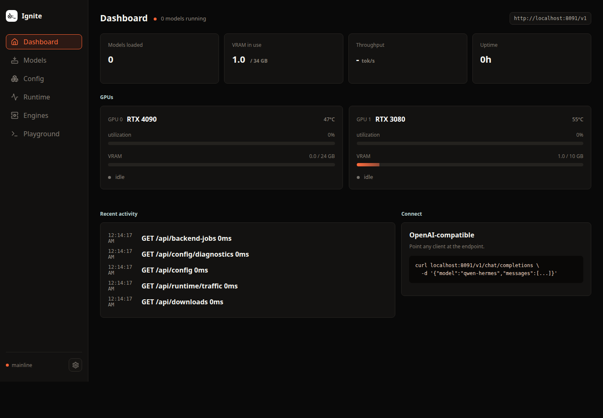
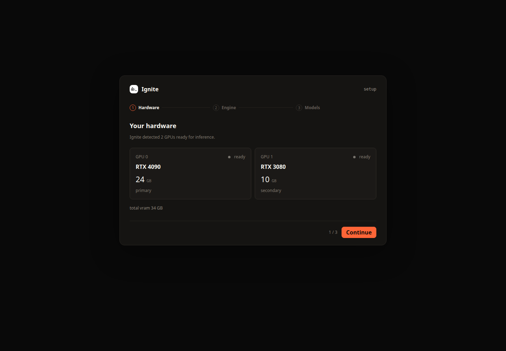

# Ignite

**Get local AI running with guided setup instead of manual runtime wiring.**

Ignite is a local runtime manager for GGUF models and llama.cpp. It handles the work between "I have a GPU" and "I want an OpenAI-compatible local endpoint": engine setup, hardware-aware model discovery, downloads, model configuration, process management, swapping, and runtime visibility. No Docker. No Python runtime. One Go binary with the web UI embedded.

Ignite v2 is a complete rewrite in Go. The original Python/Docker version is archived on the `v1-archive` branch.



---

## The problem

Running local models today means picking a llama.cpp build, compiling it with the right CUDA flags, finding a GGUF that fits your VRAM, writing config, managing processes, and figuring out model swapping. If you have done it before, it takes an afternoon. If you have not, it can take a weekend.

## What Ignite does

Build Ignite, run it, and open the local web UI. Ignite detects your GPUs, helps build llama.cpp, shows GGUF models that fit your hardware, downloads files from Hugging Face, and exposes an OpenAI-compatible API at `localhost:8091/v1`.

After setup, Ignite manages your inference stack:

- **OpenAI-compatible API** - drop-in endpoint for apps that speak OpenAI-style chat, completions, and embeddings
- **Automatic model loading and swapping** - request a configured model by ID or alias and Ignite loads it if it is not already running
- **Multi-GPU support** - assign models to specific GPUs and run models on different GPUs concurrently
- **Model discovery** - search Hugging Face GGUF repos and see hardware fit badges before downloading
- **Engine management** - clone, build, update, and switch llama.cpp backends from the UI
- **Web dashboard** - GPU monitoring, loaded model status, recent activity, endpoint snippets, runtime traffic, config, and playground

Everything runs locally. Ignite uses native llama.cpp subprocesses and keeps config, logs, state, model files, and backend checkouts on your machine.



---

## Quick start

### Requirements

- NVIDIA GPU
- CUDA toolkit for building/running CUDA llama.cpp builds
- Go 1.24+
- Node.js 20+ and `npm` for building the embedded web UI from source

### Build and run

```bash
git clone https://github.com/Spadav/Ignite.git
cd Ignite
make build
./ignite
```

First launch walks you through setup. After that, open:

```text
http://localhost:8091
```

The OpenAI-compatible endpoint is:

```text
http://localhost:8091/v1
```

### Run as a service

```bash
sudo cp ignite /usr/local/bin/
sudo tee /etc/systemd/system/ignite.service << 'EOF'
[Unit]
Description=Ignite
After=network.target

[Service]
ExecStart=/usr/local/bin/ignite --config /path/to/ignite.yaml
Restart=always
User=your-username

[Install]
WantedBy=multi-user.target
EOF

sudo systemctl enable --now ignite
```

---

## How it works

Ignite manages llama.cpp as native subprocesses. When a request comes in for a configured model:

1. Resolves the model ID or alias from config
2. Loads the model if it is not already running
3. Applies runtime-group swap rules for models in the same group
4. Starts `llama-server` with the configured flags, GPU assignment, and model file
5. Waits for health checks, proxies the request, and records request/response timing
6. Tracks idle time and unloads models after the configured TTL

Models on different GPUs can run concurrently. Models in the same runtime group can swap each other out depending on group settings.

---

## Configuration

Ignite uses a single YAML config file. The web UI reads and writes it, and you can also edit it by hand.

```yaml
listen: "0.0.0.0:8091"

backends:
  mainline:
    path: ./llama-backends/mainline
    binary: build-ignite/bin/llama-server
    buildDir: build-ignite
    repo: https://github.com/ggml-org/llama.cpp

activeBackend: mainline
modelsPath: ./models
mmprojectsPath: ./models/mmproj

ttl:
  global: 600

models:
  my-model:
    family: My Models
    profile: Default
    file: some-model-Q4_K_M.gguf
    gpu: GPU-abc123
    args: >-
      --jinja -ngl 99 -c 32768 -fa on
      --cache-type-k q4_0 --cache-type-v q4_0
      --split-mode none --main-gpu 0
    aliases:
      - default

groups:
  main:
    swap: true
    persistent: true
    members:
      - my-model
```

See `ignite.example.yaml` for a complete safe default.

---

## UI

| Page | Purpose |
|------|---------|
| **Dashboard** | Live GPU stats, loaded models, recent requests, and endpoint info |
| **Models** | Local GGUF library, Hugging Face discovery with hardware fit badges, and downloads |
| **Config** | Per-model settings, launch args, GPU assignment, aliases, and runtime groups |
| **Runtime** | Live request/response traffic viewer with timing and token counts |
| **Engines** | llama.cpp backend management: clone, build, update, and inspect |
| **Playground** | Test configured models with request options, image input, response parsing, and expert JSON |
| **Settings** | Global paths, ports, TTL, health checks, about links, and update notification |

---

## API

```bash
curl http://localhost:8091/v1/chat/completions \
  -H "Content-Type: application/json" \
  -d '{"model": "my-model", "messages": [{"role": "user", "content": "hello"}]}'

curl http://localhost:8091/v1/models
```

Request any configured model by model ID or alias. Ignite forwards the request to the appropriate llama.cpp server after loading the model if needed.

---

## Looking for local TTS and STT?

Check out **[Timbre](https://github.com/Spadav/Timbre)** - a local voice gateway with OpenAI-compatible endpoints and swappable backends.

---

## Development

```bash
make backend
make frontend
make test
make build
```

`make build` builds the web UI first, embeds it into the Go binary, and writes `./ignite`.

---

## Previous version

Ignite v2 is a complete rewrite. The original version is archived on the [`v1-archive`](../../tree/v1-archive) branch.
